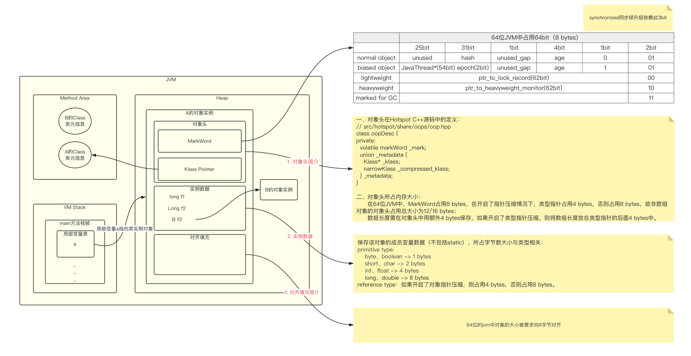
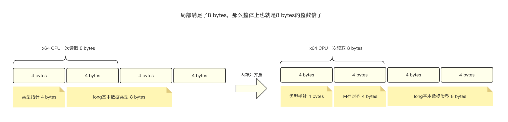
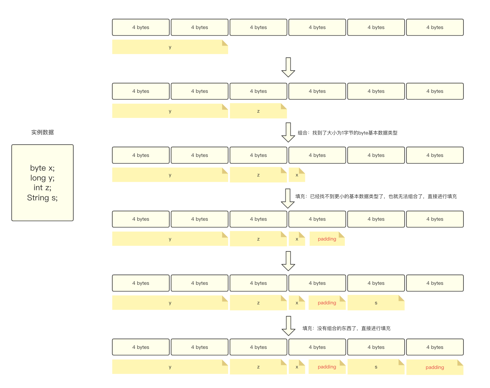
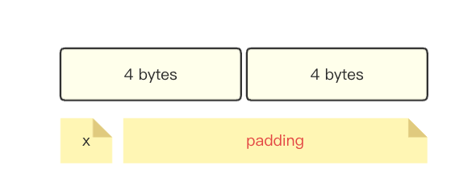
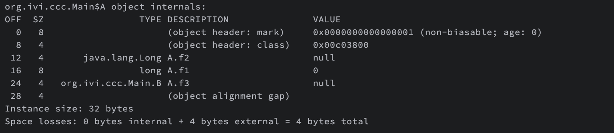
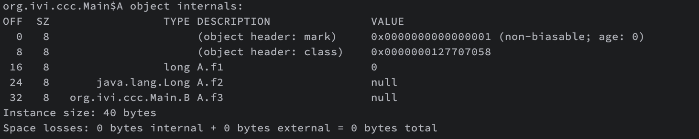
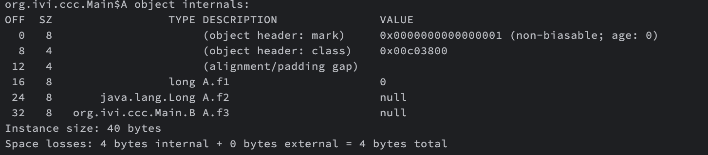

&nbsp;&nbsp;&nbsp;&nbsp;&nbsp;&nbsp;&nbsp;&nbsp;在JDK1.6 JVM中，对象实例在堆内存中被分为了3个部分：`对象头`、`实例数据`和`对齐填充`，其中对象头由MarkWord、类元信息（类型指针）以及数据长度（数组对象才有）组成。



## 一、对象头

### 1. MarkWord

&nbsp;&nbsp;&nbsp;&nbsp;&nbsp;&nbsp;&nbsp;&nbsp;MarkWord被设计成一个非固定的数据结构，以便在极小的空间内存存储尽量多的数据，它会根据对象的状态复用自己的存储空间，也就是说在运行期间MarkWord里存储的数据会随着锁标志位的变化而变化。

&nbsp;&nbsp;&nbsp;&nbsp;&nbsp;&nbsp;&nbsp;&nbsp;由上图可知对于普通对象，前25bit都是没有用的，使用31bit存储hashcode值，使用4bit存储分代年龄，故`MaxTenuringThreshold`的最大值只能为15，同时使用1bit判断是否是偏向锁，2bit用作锁的标志位。

&nbsp;&nbsp;&nbsp;&nbsp;&nbsp;&nbsp;&nbsp;&nbsp;锁升级功能主要依赖于MarkWord中的锁标志位和释放偏向锁标志位，Synchronized同步锁就是从偏向锁开始的，随着竞争越来越激烈，偏向锁升级到轻量级锁，最终升级到重量级锁。本文不做具体介绍，详情请看[同步锁升级的过程](../../../juc/locks/synchronized_lock_escalation.md)。

### 2. Klass Pointer

&nbsp;&nbsp;&nbsp;&nbsp;&nbsp;&nbsp;&nbsp;&nbsp;该字段存储对象的类元数据的指针，JVM通过这个指针来确定这个对象是哪个类的实现。


## 二、实例数据

&nbsp;&nbsp;&nbsp;&nbsp;&nbsp;&nbsp;&nbsp;&nbsp;其中保存了对象实例化后成员变量的数据指针，占用的内存大小见上图。


## 三、对齐填充

&nbsp;&nbsp;&nbsp;&nbsp;&nbsp;&nbsp;&nbsp;&nbsp;在64位JVM中，堆中存储的每个对象大小都要求是8字节的整数倍，具体情况如下图：



&nbsp;&nbsp;&nbsp;&nbsp;&nbsp;&nbsp;&nbsp;&nbsp;上图中我们使用类型指针和long基本数据类型作为4字节和8字节的代表。为了提升CPU访问内存的速度，对象内部所有的组成部分大小设计为均不超过8字节，并且引入了内存对齐这一概念。

> 如果没有内存对齐，那么CPU要访问8 bytes的数据，则共需要访问2次内存，第一次访问前4 bytes，第二次访问后4 bytes，这样是不可取的。

&nbsp;&nbsp;&nbsp;&nbsp;&nbsp;&nbsp;&nbsp;&nbsp;内存对齐的方式可分为`组合`和`填充`两种方式：组合是通过与实例数据中的数据类型和对象指针组合成8字节，而填充是指将不足8字节的部分进行填充。我们用一个例子来展示内存对齐的过程（假设类型指针已经对齐）。



&nbsp;&nbsp;&nbsp;&nbsp;&nbsp;&nbsp;&nbsp;&nbsp;内存对齐我们遵循先组合再填充的原则，在实例数据部分，我们优先排列8字节的基本数据类型(long / double)，然后再排列4字节的基本数据类型 (int / float)，此时就涉及到内存对齐。我们进行组合的优先级为`int/float -> short/char -> byte/boolean -> 引用类型`（其中需要开启UseCompressedOops才能查找引用类型，否则引用类型为8字节，不满足查找条件）。组合完成后，若组合整体还没满足8字节，则进行填充。依次进行下去，直到完成所有数据的排列。

> 当UseCompressedClassPointers开启时，优先考虑将类型指针进行内存对齐，对齐原理一致。



> 若实例数据中只剩下byte基本数据类型，那么填充则有最大值：7 bytes

&nbsp;&nbsp;&nbsp;&nbsp;&nbsp;&nbsp;&nbsp;&nbsp;引入内存对齐后，也同时带来了内存空间增加的问题，此时就需要指针压缩出场了，它会将8 bytes的引用数据类型压缩成4 bytes，此时堆空间的压力就不会那么大，而且不会有那么多padding了，提供了更多的组合机会，提高了内存资源利用率。


## 四、指针压缩

由上节我们可知，每个对象都是8字节的整数倍，举个栗子，我们对象地址都是0开始且连续的，


指针压缩顾名思义就是将指针从8字节压缩成4字节，


> 指针所占内存的大小表示所指对象的大小范围，例如指针占用4字节的空间，那么该指针将拥有32位二进制来表示所指向对象的大小范围，即所指向对象的最大值为2^32^ -> 4G。


> 对象头中类型指针压缩 -> UseCompressedClassPointers
>
> 实例数据部分对象指针压缩 -> UseCompressedOops
>
> > 在JVM中默认两者都会被开启，但是在使用[ZGC](../../05. GC/garbage-collector/ZGC.md)的时候，会默认关闭指针压缩。
>
> > 以上两种参数可以互相组合使用，但是在JDK15正式使用ZGC之前，关闭对象指针压缩，同时开启类型指针压缩是不建议使用的，JVM会进行警告。


当堆内存 < 4G时，不需要启动指针压缩，JVM会直接去除32位高地址，避免了编解码过程。

如果堆内存在4 ~ 32G，则会开启指针压缩。

如果堆内存大于32G，压缩指针会失效，使用原来的64位来进行寻址。


## 五、使用Java API来验证

&nbsp;&nbsp;&nbsp;&nbsp;&nbsp;&nbsp;&nbsp;&nbsp;我们首先需要导入openjdk提供的API依赖，本文使用Maven做依赖管理。

```xml
<dependency>
    <groupId>org.openjdk.jol</groupId>
	<artifactId>jol-core</artifactId>
    <version>0.16</version>
</dependency>
```

&nbsp;&nbsp;&nbsp;&nbsp;&nbsp;&nbsp;&nbsp;&nbsp;完整的代码示例如下，在main方法中实例化对象a后，添加一行：

```java
public class Main {
    public static void main(String[] args) {
        A a = new A();
        System.out.println(ClassLayout.parseInstance(a).toPrintable());
    }
    
    static class A {
		long f1;
        Long f2;
        B f3;
    }
    static class B {
    }
}
```

&nbsp;&nbsp;&nbsp;&nbsp;&nbsp;&nbsp;&nbsp;&nbsp;由于默认开启了指针压缩，故类型指针大小为4 bytes，Long和B的对象指针都为4 bytes，最终输出的结果如下：



&nbsp;&nbsp;&nbsp;&nbsp;&nbsp;&nbsp;&nbsp;&nbsp;当我们关闭指针压缩后，该情况不会产生任何填充，最终结果如下图：



&nbsp;&nbsp;&nbsp;&nbsp;&nbsp;&nbsp;&nbsp;&nbsp;如果我们只关闭对象指针压缩（-XX:-UseCompressedOops），最终结果如下图：



&nbsp;&nbsp;&nbsp;&nbsp;&nbsp;&nbsp;&nbsp;&nbsp;获取当前虚拟机的对象信息：

```java
// -XX:+UseCompressedClassPointers -XX:+UseCompressedOops -XX:+UseG1GC
public class Main {
    public static void main(String[] args) {
        VM.current().objectHeaderSize(); // 获取对象头大小，默认12 bytes
        VM.current().arrayHeaderSize(); // 获取数组对象头大小，默认12 + 4 = 16 bytes
        VM.current().classPointerSize(); // 获取类型指针的大小 4 bytes
    }
}
```


参考文章：

- [java对象结构以及对象大小计算示例](https://blog.csdn.net/jinxinxin1314/article/details/106170881)
- [详解Java对象内存结构以及指针压缩原理](https://betheme.net/houduan/28931.html?action=onClick)
- [一文聊透 JVM 内存分布、内存对齐、压缩指针！](https://mp.weixin.qq.com/s/_q2P4HGJv7d16PSVxUuy0g#)